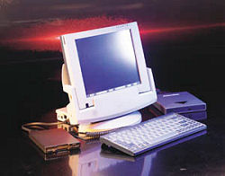

# The Fujitsu Stylistic 3400 in 2020 <!-- omit in toc -->

## Contents

- [Contents](#contents)
- [Preface](#preface)
- [Introduction](#introduction)
- [Drivers](#drivers)
- [Hardware limitations](#hardware-limitations)
  - [Limited USB support](#limited-usb-support)
  - [192 MB maximum RAM](#192-mb-maximum-ram)
- [Documentation](#documentation)

## Preface

Yes, I bought a crappy Pentium III Windows tablet in 2020. I know I make bad life decisions... you don't have to tell me.

This webpage or GitHub repo (depending where you're seeing this) is made to aggregate a bit of info from across the web together into one convenient place for people who are (for some insane reason) researching this.

## Introduction

The Stylistic 3400 (model number FMW4203TXA01) released in November 20001. It was one of the first pen-based computers which worked well enough for businesspeople to use it for any amount of real work.

The 3400 was a completely new product compared to what Fujitsu has released in the past across the Stylistic range, running Intel Pentium III or Celeron processors at an *extraordinary 400 MHz(!)*, shipping with 64 MB RAM soldered to the motherboard.

The device was intended to be treated as a portable and dockable system, meaning you would use it during a commute or on-location, as well as at a desk in the dock accessory.

The main use case pushed by Fujitsu appears to be Hospitals, as they are mentioned consistently through the [promotional material](#documentation).

1 - [First article online](https://fcw.com/articles/2000/11/28/fujitsu-steams-ahead-with-stylistic.aspx) from 28 Nov 2000. ["TheNeil"](https://web.archive.org/web/20201125000306/http://www.theneil.plus.com/retrostylistic3400.html) also records November 2000 as the release date on his retro collection website.

> 
>
> Image of the docked Stylistic 3400, along with a floppy drive (using a proprietary connector), USB CD drive and keyboard

## Drivers

Surprisingly, the [official Fujitsu drivers page](http://www.shopfujitsu.com/CSPortal/supportsearch.do?srch=DOWNLOADS&Series=Stylistic&Model=Stylistic%203400&ProductType=Tablet%20PC) for this product is still live as of 2020.

Despite this, I've still made a copy of all the drivers for historical purposes because, at some point, this will go down!

See the [drivers page](drivers/README.md) for more info.

## Hardware limitations

### Limited USB support

Despite having a single USB 1.1 port, the device does not support USB boot.

### 192 MB maximum RAM

According to [an online forum post on MacRumours](https://forums.macrumors.com/threads/ram-upgrade-for-fujitsu-stylistic-3400.205327/) (ironic as it's a Windows tablet), the device only supports 192 MB RAM at a maximum.

It shipped with 64 MB soldered to the motherboard, but could be expanded by a 32 MB, 64 MB, or 128 MB 144-pin SDRAM SODIMM stick. Apparently the BIOS is only capable of detecting sticks up to 128 MB, despite 512 MB sticks being available to buy. **I cannot confirm this claim at the moment.**

## Documentation

See the [dedicated documentation page](docs).
